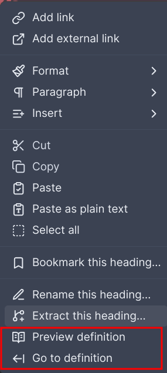

# Obsidian Note Definitions

A personal dictionary that can be easily looked-up from within your notes.

## Basic usage

1. Create a `definitions` folder in the root of your Obsidian vault.
2. Within the `definitions` folder, create definition files (with any name of your choice).
3. Add definitions according to the definition rules (see below)
4. Once a definition is registered, the word should be underlined in your notes. You may trigger a dropdown showing the definition of the word by right clicking on the word and selecting the appropriate option, or using a command.

### Editor menu

Options available:
- Preview definition (show definition dropdown)
- Go to definition (jump to definition of word)

### Commands

It is recommended to assign hotkeys to the following commands for convenient access:
- Preview definition (show definition dropdown)
- Go to definition (jump to definition of word)

## Definition rules

**Note Definitions** uses markdown syntax to parse the definition files.
This is so as to keep the definition file looking like just another markdown file as opposed to introducing custom syntax for these files.
However, this means that certain restrictive rules need to be followed:

1. A definition block consists of a word, an alias (optional) and a definition. They must be strictly provided in that order.
2. A word is denoted with a line in the following format `# <WORD>`. This is rendered as a markdown header in Obsidian.
3. An **optional** alias is expected after a word. This must be a line surrounded by asterisks, eg. `*alias*`. This is rendered as italics in Obsidian.
4. A line that occurs after a registered **word** and is not an alias is deemed to be a definition. Definitions can be multi-line. All subsequent lines are definitions until the definition block delimiter is encountered.
5. A line with nothing but three hyphens `---` is used as a delimiter to separate definition blocks. This is rendered as a delimiting line in Obsidian.

Example definition file with two definition blocks:

> # Word1
> 
> *alias of word1*
> 
> Definition of word1.
> This definition can span several lines.
> It will end when the delimiter is reached.
> 
> ---
> 
> # Word2
>
> Notice that there is no alias here as it is optional.
> The last word in the file does not need to have a delimiter, although it is still valid to have one.

## Feedback

I welcome any feedback on how to improve this tool.
Do let me know by opening a Github issue if you have any ideas for features or improvements.

## TODOS

- [ ] Add setting to customise definitions folder
- [ ] Decorations/formatting for definition files
- [ ] Scoped definitions (definitions that are scoped to certain folders or files)
